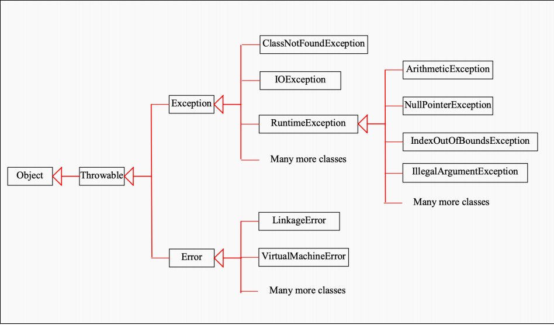

# JAVA IO and Exception Handling
## 1. Concept Introdution

**JAVA IO**


> Information Transaction between JAVA and physical device is through **Stream**. 

Java IO has two types:
- **Byte streams**: binary data (not covered in this lesson)
  - Input Stream (System.in)
  - Output Stream (System.out)
- **Character streams** (coverd in this lesson)
  - Reader
  - Writer

There are three stream varible, which are defined in JAVA.IO package.They are declared with *Public*, *Final*, and *static* :
- **System.in**: Standard input stream get from keyboard
- **System.out**: Standard output stream to console
- **System.err**: Special use of output stream to console
----
**Exception Handling**


> Error can be categorized into run-time error and compile error. **Compile Error** is automatically detected and reported by compiler. **Run-Time Error** is detected by JVM. 
> 
> **We can define Exception Handler to cope with Run-Time Error.**

**There Five Keywords in Exception Handler:**
- **try**: exception monitor
- **catch**: catch exception inside *try* and define how to respond to it
- **throw**: throw an exception to be dealt outside
- **throws**: used in method signature to declare an exception might be thrown by executing this method
- **finally**: last step in handling. It usually relates to close resources before exit


## 2. BufferedReader
> BufferedReader is a class defined in JAVA.io having several features.
> - **Synchronize**: sync between muliple thread -> *thread safety*; 
> - **No Parsing**: It just read stream an don't automatically parse the stream into primitive types -> *high freedom* 
> - **Larger Buffered Memory**: It is good at read a *long string*


**(1) Initial BufferedReader**:

System.in is a *byte stream*, which needs **InputStreamReader** to decode it into *Character Stream*
```JAVA
InputStreamReader iReader = new InputStreamReader(System.in); 
BufferedReader bReader = new BufferedReader(iReader);
```
If it wants to read from a file, it need to call **FileReader** instead:
``` JAVA
BufferedReader bReader = new BufferedReader(new FileReader("file path"));
```

**(2) Call read() & readLine() methods** :

It should be noticed that:
- *.read()* method return a **ASCII** code in a int type, which needs *(char)* to convert int into char. 
- *.readLine()* method directly return a **String** type.
```JAVA
char c = (char)bReader.read() // read a character
String str = bReader.readline() // read a line
```

**In order to make calculation, it is need to convert into int type**. This problem is sovled in [Lab Q 5.4](./LAB/main.java):
```JAVA
int input = Integer.parseInt(bReader.readLine()); //parseInt() needs String type input, which means it can only performed on .readLine()
```

**(3) Exception Handle**

**Both .read() and .readLine() throws IO Exception. It is clearly demonstrated in [Lab Q5.3, Q5.4, Q5.5](./LAB/main.java)**

**There several points should be pay attention to given to the lab:**
- If deal with keyboard input, it might need to handle *InputMismatchException*
- If calling *Integer.parseInt()* method, it need to handle *NumberFormateException*
- *Readers* can be viewed as a kind of *resources*. Reader Initialization can be put into *try* clause as parameters to omit *finally*
  
## 2. Scanner

> Scanner is defined in *java.util*,which has following features:
> - **automatic parsing**: convenient to use
> - **high read efficiency**: quick than bufferedreader

**(1) Initial Scanner**

The cursor of scanner move automatically once the function is called.

It is no need to throw exception
```JAVA
Scanner sr = new Scanner(System.in);
//read primitive type 
sr.nextLine();
sr.nextInt();
sr.nextDouble();
sr.nextShort();
```
**(2) Frequent Problem**

- When this method is not successfully terminated(such as Exception Handling), the cursor will not move to the next position. (see [Lab Q5.2](./LAB/main.java))

## 3. File Handling

**(1) FileReader**
```JAVA
FileReader(String filePath) throws FileNotFoundException
```
Once file is open, it should be closed when manipulation is finished. For instance, it needs to be added in the *finally* clause when handling exception
```JAVA
objectName.close();
```

**(2) FileWriter**
If *boolean append* is true, the output will be append to the end of the file.
```JAVA
FileWriter(String filePath, boolean append) throws IOException
```