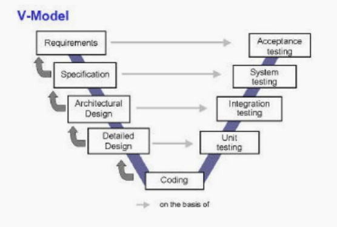

# Topic 1: Definition of Software and Software Engineering
## Software
**Software**: (Computer programs + assoicated documentation) -> targeted customers or market

**An installation package normally contains**:
- Compiled code
- Documentation
- Configuration components
- Self Upgrade/Installation/Uninstallation code

**For a good software**: with good functionality and performance, which are:
 1. *Maintable*: designed to meet the updating customer demands ( e.g. good documentation and version control )
 2. *Dependable*: reliability,security and safety (e.g. bug free)
 3. *Efficiency*: try the best to make full use of memory and process cycles to eliminate waste
 4. *Acceptabiligy*: It meets the demands of different types of targeted users. It also needs to be understandable, usable and compatible

**Related Concept**: Scripts
- *Differences*: (1) Scripts focus on achieve a certain function; (2) Develope for other engineers not the customer;
- *Connections*: (1) A software is composed of many scripts; (2) software can be view as a "final good", while scripts can be view as a "Intermediate good"
- *Note*: Python is a good tool for scripts, but not softwares

## Software Engineering
**Software Engineering**: A (systematic + disciplined + quantifiable) maanner to develop good software
**It contains thses core stages**:
- *Specification*: what should do (function) + what should not do (constraints)
- *Development*: production & implementation
- *Validation*: check the demand of the customer
- *Evolution*: updating code in response to demands

**These stages are organized into different workflow and becomes different engineering models:** 
### waterfall model

**problem**: The design is not always complete. If discovering problems in the late stage, it is costly to go back and fix the problem.

**Variant**: formal system development, which use mathematical modelling to essure the correctness of design (useful to develop the system with stringent safety and reliability requirements)

**Selection of model is determined by the type of systems, which might depends on:**
- *Heterogenity*: compatibility across different platforms (software and hardware)
- *Business and social change* 
- *Security and trust*

### V Model (Verification and Validation Model)

**Advantages:** It is a highly disciplined model and works well when the requirements are stable and clearly defined.

**disadvantages:** Inflexible for updating and time-consuming

### Iterative model (Incremental development)

**Advantages**: 
- *Low updating cost*; 
- *Short feedback cycle*; 
- *Rapid delivery for the most urgent function*;

**Disadvantges**: 
- *Invisible process* : quick version updates make manager hard to make documentation to measure the achievements
- *Fragile structure* : regular changes tends to corrupt its structure. It might cost lot to incorporating the software in the late stage.

### Reuse-oriented model

**Advantages**: Low cost and quick deployment;

**Disadvantages**: May not meet the customer's real demand and have problems in updating

