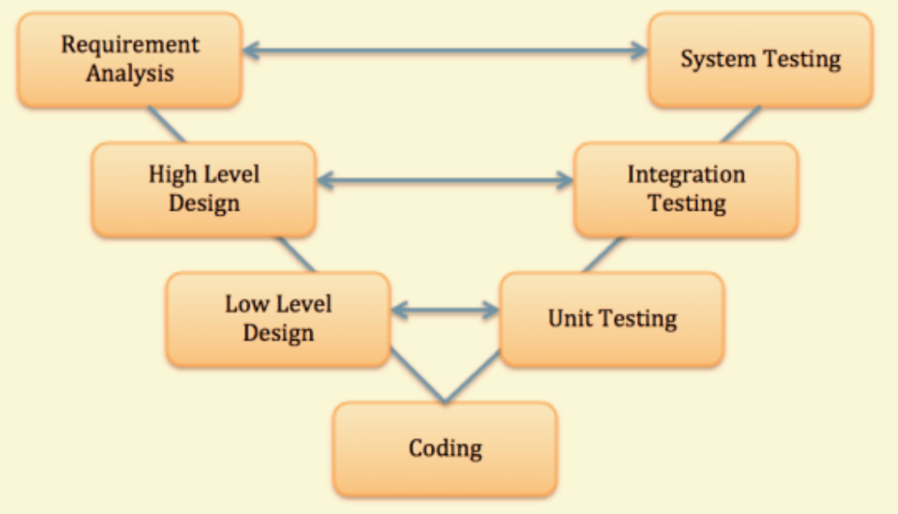
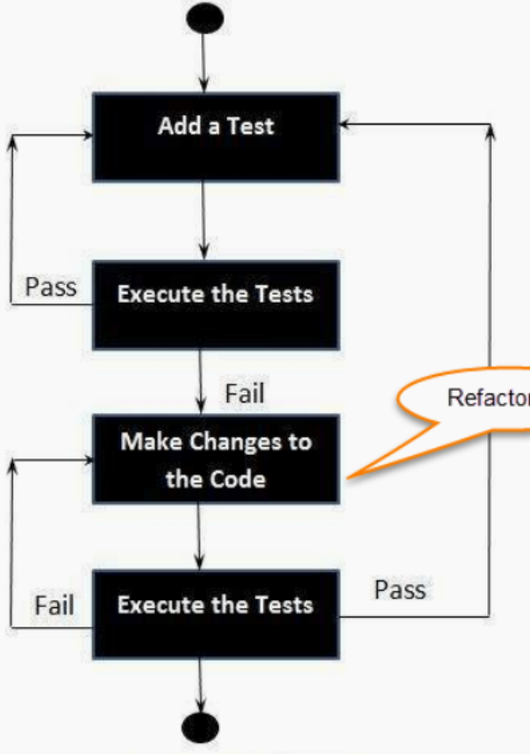

# Testing

> Acorrding to the V-model, testing is closely related to the whole designing and planning process.

## General Testing Strategy

**(1) Black Box & White Box Test**

|strategy|Focus|Premise| Worker | Efficiency|
|--------|-----|---------------|----------------------------|------|
|White Box| Internal Structure |Design documents and diagram|Developers understand code| Low
|Black Box| Functionality      | Requirement specification  |Tester don't require code understanding | High |

**White Box Testing concerns code coverage**:
- *Data Flow Testing*: life-time value of data variable 
-  *Statement Coverage*: Coverage of each line of code
-  *Branch Coverage*: Coverage of logical branch
-  *Coumpound Coverage*: Combination of logicala branch
-  *Path Testing*: Each independent usage path (omit impossible compound coverage)
-  *Loop Testing*: Check if iterate and end condition is right

**Tecniques for Black Box Testing:**
- *Equivalence Partitioning*: divide input values into different classes and groups based on its similarity in the outcome
- *Boundary Value Analysis*: test boudary value
- *Decision Table Testing*: use decision table to design a complete test set for logical relations
- *State Transition Testing*: test if state work well and if state can transit well
- *Error Guessing*: Guess the error-prone areas
- *Comparsion Testing*: Test among different software version to make comparison

**(2) Manual Test & Automatic Test**

Automatical Test is good at *Efficiency*,*Reliability*,*Accuracy* and *Cross Platform*, while mannual test is only good for measure human-machine interaction.

## Unit Test and Test-Driven Development ##
> Testing Driven Development is a SE approach using test cases to lead the whole development process.
> The test case is used to clearly specify the requirement of code and measure if the requirement is meet.

**Test Driven Procedure**

**Junit**

## Integration Testing
Combine all units and check if they can work together properly.

It has several techniques:
- *Top Down* : starts from top-level towards the lower-level modules. Use dummy modules to replace the lower-level module have not been developed
- *Bottom-up* : starts from lower-level towards the higher-level modules. Use drivers if the higher-level have not been developed
- *Hybrid Integration* : starts from the middle-level and carry test towards both directions

## System Testing

> Check if the system meet the full specification, including functional and non-functional ones. The primary goal is to convince the client the software is ready to delievered.

**It contains several types:**
- *Usability Testing*: user-friendly or not
- *Load Testing*: test non-functional parts
- *Regression Testing*: test new updates can affect existing features or not
- *Recovery Testing*: if the software can recover from crashes
- *Migration Testing*: if the software can run on new system infrastructure
- *Functional Completness Testing*: think of any possible missing functions
- *Hardware/Software Testing*: test the interactions between the hardware and software

>It is impossible to test everything, which needs a strategy to enhance efficiency

**Performance Driven Strategy**

**1. Methods**:
- *Load Testing* : test the application with increasing loads until reach uppper limits
- *Stress Testing* : test stability of the application in terms of hardware
- *Scalability Testing*: test of it can scale its operation
- *Endurance Testing*: test stability working a long period of time
- *Volume Testing*: test if it can holds up against a large amount of data

**2. Test Metrics**
- *Response Time*
- *Resources Utilization*: database, memory, I/O and CPU
- *Workload*: number of users and concurrent tasks
- *Throughput*: amount of transactions the software can implement

**Scenario Driven Strategy**

## Acceptance Testing

Done by Customer using real data to decide if the software can be deployed in practice
